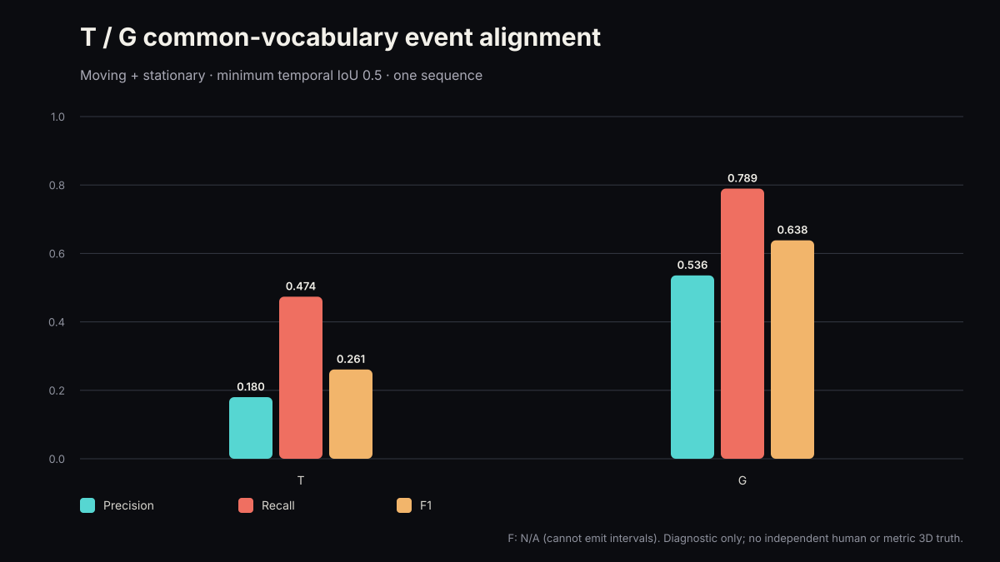
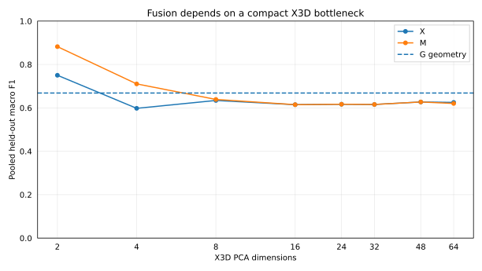
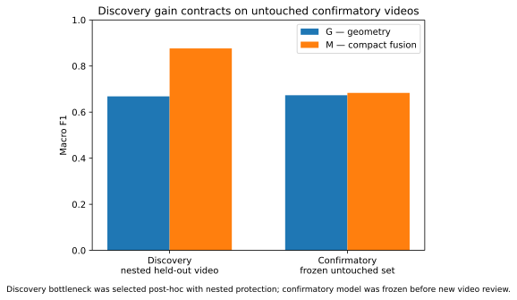
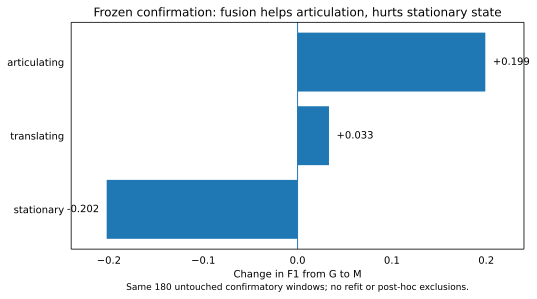

# From Relationships to Motion

## What X3D Adds to Camera-Aware Geometry — and Where Late Fusion Fails

*Article 04 publication candidate — reviewed learned-model outputs, grouped evaluation, controlled multi-video discovery, and an independently frozen confirmatory test. The results are a bounded research study, not a general benchmark claim.*

The most convincing fusion result in this experiment was also the one I eventually stopped trusting at face value.

On four discovery videos, a compact X3D bottleneck improved held-out macro-F1 from **0.668 with geometry alone to 0.876 with fusion**. I then froze the representation, bottleneck and classifier and tested four untouched videos. The advantage contracted to **0.683 versus 0.673**.

That contraction became more informative than the original gain. X3D was not adding generic “motion intelligence.” Its useful residual was much more specific: it improved **articulation** substantially, improved **translation** slightly, and actively damaged **stationary** decisions that geometry was already getting right.

The original architectural question was simple: **can camera-aware 3D geometry and a 3D CNN become more useful together than either representation alone?** The answer turned out to be yes, but only conditionally. Complementary evidence is not automatically safe evidence.

The scene below is the clearest visual summary. It starts from a real frame in the independent confirmatory set and connects persistent object support to two different forms of motion evidence: world-relative geometry from VGGT and local spatiotemporal structure from X3D-S.

*Visual abstract — actual CF02 frame at source t = 4.0 s. SAM 2 provides the tracked object support for the stationary microwave, translating box and articulating cook. The cube contains all 45 reviewed windows from that scene: x is VGGT object displacement normalized by object extent; y/z are the two frozen X3D bottleneck components. Black rings mark windows where geometry alone was wrong and fusion corrected it. CF02 is an explanatory positive case, not the aggregate result.*

## Artifacts

- [GitHub repository](https://github.com/vlada22/grounded-temporal-intelligence-public)
- [Reviewed Semantic Motion Explorer](demo/README.md)
- [Original representation-level fusion result](results/representation/README.md)
- [Controlled multi-video discovery result](results/discovery/README.md)
- [Independent frozen confirmatory result](results/confirmatory/README.md)

## What I found

The experiments made the original fusion idea more specific — and less convenient.

1. **Geometry has to be made honest first.** On the original sequence, camera-aware VGGT geometry improves event alignment substantially over screen-space temporal motion.
2. **A leaky split can manufacture the success story you want.** Randomly splitting overlapping windows pushed X3D/fusion to roughly 0.96 F1; grouped holdout collapsed that apparent gain.
3. **More representation is not automatically better fusion.** A dense 2048-D X3D branch initially made the classifier worse, even after the representation path itself was corrected.
4. **A compact bottleneck exposed a transferable X3D signal.** On a controlled four-video discovery benchmark, constraining X3D to a tiny training-only subspace changed M from failed concatenation into the best held-out model.
5. **Independent confirmation shrank that gain dramatically.** With the bottleneck and classifier frozen before new videos were reviewed, M moved from 0.673 to 0.683 macro-F1 over G — technically positive, but nowhere near the discovery gain.
6. **The useful complementarity is class-specific.** In the untouched confirmatory set, fusion improves articulation by about +0.199 F1 and translation by +0.033, while degrading stationary classification by about -0.202.
7. **The missing fusion layer is reliability.** X3D contains useful residual evidence, but it should not be allowed to override geometry uniformly.

The result I would carry forward is therefore not simply “CNN + transformer works.” It is:

> **Complementary representations are not automatically compatible representations. A compact bottleneck can expose useful residual motion evidence, but the next fusion layer has to learn when that evidence is trustworthy.**

## The system I actually tested

The representation has three learned components with deliberately different roles:

**SAM 2 → persistent object support**  
**VGGT → camera-aware 3D geometry**  
**X3D-S → local spatiotemporal representation**

SAM 2 provides the association seam: after review, the geometry and video descriptors can refer to the same object timeline. VGGT contributes model-world camera state, centroids, extents and displacement. X3D-S contributes masked object-centric short-term dynamics.

The downstream task is not to merge those quantities into one fake latent coordinate system. It is to combine them while preserving what each branch means.

That distinction became important almost immediately.

## Finding 1 — geometry should come before video fusion

The original source contains camera motion, static objects, rigid translation, articulated motion, occlusion, hard cuts and a blended transition.

I first compared two temporal representations that could emit the same `moving` / `stationary` event vocabulary:

- **T:** persistent identity plus screen-space motion;
- **G:** persistent identity plus camera-compensated VGGT geometry.

Against two frozen AI-assisted source reviews — used as provisional reference passes, not human validation — T reaches F1 0.261 and 0.254, while G reaches 0.638 and 0.653 at temporal IoU ≥ 0.5.

This is not a general benchmark, but it establishes an important boundary for the rest of the article: **local video dynamics should augment a camera-aware state, not be asked to rediscover camera geometry implicitly.**

That is why G becomes the meaningful baseline for the fusion experiments.

## Finding 2 — naive X3D fusion can make the system worse

The first supervised G/X/M experiment used dense object-centric windows from one synthetic sequence.

After correcting the X3D path to use masked RGB and a 2048-dimensional pre-classifier representation, the result was still negative:

| condition | F1 | balanced accuracy |
| --- | ---: | ---: |
| G — geometry | **0.478** | **0.738** |
| X — X3D | 0.230 | 0.543 |
| M — G + X | 0.291 | 0.620 |

That failure was useful. The 2048-D X3D representation carried far more than the downstream task needed: object appearance, local activity and scene-specific structure. Concatenating it with a small geometry vector gave the classifier many ways to fit the wrong invariances.

The most revealing diagnostic was deliberately invalid. When overlapping windows from the same tracks were randomly divided between train and test, X and M jumped to roughly 0.96 F1. Under grouped holdout, they collapsed.

That result changed the direction of the work. A superficial split could have “proved” exactly the claim I wanted. Grouped evaluation showed that the representation was recognizing highly similar objects and windows rather than learning a transferable motion rule.

So I stopped trying to rescue the single-sequence score and changed the experiment.

## Finding 3 — a compact bottleneck exposes useful complementarity

The next benchmark used four independent synthetic videos with different camera regimes and three motion states in every video:

- **stationary** — no object motion;
- **translating** — rigid-body movement through the scene;
- **articulating** — local part motion while the entity remains approximately fixed in world position.

Each video became one reviewed 96-frame analytic clip. The final discovery set contained 172 reviewed windows, and evaluation held out the **entire video** so no object identity, overlapping window or scene from the test video entered training.

The originally planned 32-dimensional X3D PCA fusion still failed:

| condition | macro F1 | balanced accuracy |
| --- | ---: | ---: |
| G — geometry | **0.668** | **0.694** |
| X — X3D | 0.616 | 0.617 |
| M — wide fusion | 0.616 | 0.617 |

More independent data alone did not solve the compatibility problem.

Then the dimensionality sensitivity analysis produced the strongest discovery finding in the article:

With a very small X3D subspace, M improves sharply. As more X3D dimensions are admitted, fusion progressively collapses back toward the weaker X-only branch.

Because that pattern was discovered post-hoc, I did not simply report the best point. I repeated the selection inside a nested leave-one-video-out protocol. For every outer held-out video, the PCA width was chosen only from the three outer-training videos.

The inner procedure independently selected **two X3D components in all four outer folds**.

The resulting discovery performance was:

| condition | macro F1 | balanced accuracy |
| --- | ---: | ---: |
| G — geometry | 0.668 | 0.694 |
| X — X3D bottleneck | 0.621 | 0.609 |
| **M — compact fusion** | **0.876** | **0.872** |

M corrected 45 G errors while introducing 13 regressions. Articulation showed the strongest class-level gain.

This was the first strong evidence that the branches were not merely different — they could become useful together when the X3D branch was constrained to a compact, transferable subspace.

But it was still a discovery result. The two-dimensional bottleneck had been found after looking at this benchmark.

## Finding 4 — frozen confirmation changes the interpretation

The next experiment froze the architecture before any new confirmatory video was reviewed:

- the nine geometry features;
- the masked 2048-D X3D representation;
- the X3D scaler;
- the **two-component PCA bottleneck**;
- the G, X and M logistic-regression weights;
- the class vocabulary;
- the primary criterion: **M macro-F1 > G macro-F1**.

Four new scenes were generated with different objects and camera paths. The analysis interval was fixed in advance at seconds 2.0–6.0. Two kitchen generations were rejected because an extra person entered that fixed interval; I regenerated the source rather than moving the interval.

After the GPU run, all 469 manifest-tracked files matched their recorded byte size and SHA-256. Before exposing classifier predictions, I reviewed all 12 SAM 2 identities and all 180 X3D windows. No confirmatory window was excluded.

Then the frozen model was applied once.

The discovery-to-confirmation comparison is the most important summary figure in the article:

The discovery gain contracts from **G 0.668 → M 0.876** to **G 0.673 → M 0.683** on the untouched confirmatory set.

The full frozen result is:

| condition | macro F1 | balanced accuracy | accuracy |
| --- | ---: | ---: | ---: |
| G — geometry | 0.673 | **0.689** | **0.689** |
| X — X3D bottleneck | 0.522 | 0.517 | 0.517 |
| **M — compact fusion** | **0.683** | **0.689** | **0.689** |

The preregistered primary criterion is technically met: M macro-F1 is higher than G macro-F1.

But the margin is only **+0.010**. Accuracy and balanced accuracy are unchanged. M corrects 41 G errors and introduces exactly 41 new errors. It beats G on macro-F1 in only one of the four confirmatory videos.

That is weak/mixed confirmation, not a replication of the discovery magnitude.

And that contraction is one of the most valuable findings in the work. Without the independent set, it would have been very easy to stop at 0.876 and overstate the architecture.

## Finding 5 — the useful X3D signal is specifically articulation

The pooled metric hides the real behavior.

The direct change from G to M on the untouched confirmatory set is:

- **stationary:** 0.653 → 0.451 F1, **-0.202**;
- **translating:** 0.932 → 0.966 F1, **+0.033**;
- **articulating:** 0.435 → 0.634 F1, **+0.199**.

This is the finding that most directly supports the original CNN/transformer intuition.

Geometry is already very strong at rigid translation because world-relative displacement is exactly what the representation preserves. It is much weaker at local articulation when the entity itself remains approximately fixed in space. That is where the short-term X3D representation adds information that a centroid trajectory cannot express.

But the same branch also hurts stationary classification. On novel appearances, local visual dynamics can look action-like even when the geometry state is correctly stationary.

So the independent experiment does not say that X3D is generally better than geometry, or even that compact fusion is generally better than geometry. It says something narrower and more useful:

> **X3D contributes residual information for local articulation, but the current fusion layer lacks a reliable way to decide when that residual should be trusted.**

## Finding 6 — the next fusion layer should be a gate, not a larger vector

The reverse-dolly kitchen scene, CF02, is the one untouched confirmatory case where the frozen fusion model clearly improves over geometry alone: macro-F1 rises from 0.633 to 0.933. That makes it a useful explanatory scene, provided it is not mistaken for aggregate evidence.

The opening visual uses that scene deliberately. It connects an **actual frame from the uploaded MP4** to the measured representation used by the classifier. SAM 2 provides persistent support for the stationary microwave, translating box and articulating cook; the 3D cube places all 45 reviewed CF02 windows using one explicit VGGT geometry variable and the two frozen X3D bottleneck components. Black rings mark the 16 windows where G is wrong and M corrects it.

It is deliberately **not** a synthetic shared embedding. The x-axis remains an interpretable geometry quantity, while the other two axes are the frozen X3D PCA components selected from the discovery data. CF02 is a representative positive case; the discovery-vs-confirmation and class-delta plots remain the aggregate evidence.

Returning to that opening visual after the confirmatory results makes the architectural implication easier to see. Rigid translation creates a strong geometry signal, while articulation can occupy a different region of the compact video subspace even when world-relative displacement stays small. The branches contribute different evidence, but the confirmatory tradeoff shows that the system still needs to decide when each branch deserves influence.

The discovery model effectively uses:

**M = [ G || B(X) ]**

where `B(X)` is the compact X3D bottleneck.

The next model I would test is closer to:

**M = G + α(G, B(X), U) · R(B(X))**

where `α` is a learned reliability gate, `R` is the video residual, and `U` can include support or uncertainty signals.

That changes the question from “how many X3D features should I concatenate?” to “when should local video evidence be allowed to alter a geometry decision?”

The confirmatory class tradeoff suggests that this is the right next problem.

## The failures were part of the result

Two lessons from the failed runs became important enough to treat as findings rather than implementation notes.

### Artifact integrity is not experiment validity

Two early GPU bundles passed their manifest checks and were still scientifically rejected. Run 00 verified all 275 tracked entries, but undeclared hard cuts created false continuity across identity, geometry and X3D tubes. The following v4 bundle verified all 288 tracked entries, but a six-frame dissolve escaped the hard-cut detector and contaminated the long laboratory shot.

The hashes proved that the returned bytes were intact. They did **not** prove that those bytes represented a valid experiment.

That distinction matters in multimodel pipelines: reproducibility has at least two layers. You need byte-level provenance, but you also need semantic validity of the time intervals, identities, coordinate systems and support used to produce those bytes.

### Cross-model disagreement became an observability signal

The missed dissolve did not first present itself as an editing problem. It appeared as a cross-model anomaly. VGGT showed a 0.2401 model-unit camera discontinuity and a 13.8° rotation between nearby retained frames. Around the same transition, SAM 2 masks developed gaps and X3D tubes crossed depicted views that should never have shared one temporal window.

Those failures looked unrelated until they were traced back to the same transition.

That suggests a useful systems principle: **when several perception branches are supposed to describe the same world state, disagreement between them can be used as an observability signal for the pipeline itself.** A geometry discontinuity can trigger identity review; identity instability can invalidate temporal tubes; temporal inconsistency can force a shot reset.

Several other failures reinforced the same boundary:

- SAM 2 produced a same-shot identity switch in the original sequence;
- the first X3D path captured task-head output rather than the representation intended for fusion;
- the pre-classifier hook initially exposed a residual 2×2 spatial grid, which had to be globally averaged to a 2048-D clip vector;
- overlapping-window splits manufactured an implausibly strong X3D result;
- one generated discovery target was not actually articulating during the whole intended interval;
- two confirmatory kitchen videos violated the frozen source protocol and were rejected rather than repaired post-hoc.

The common lesson is that **fusion does not repair invalid semantics. It propagates them.**

Identity, edit boundaries, source hashes, support validity and review state are therefore part of the representation contract, not administrative metadata.

## What this experiment establishes

The strongest defensible claims are now:

1. camera-aware geometry materially improves motion interpretation over screen-space temporal motion on the original source;
2. the pretrained X3D representation contains useful complementary information and can still hurt downstream generalization when fused naively;
3. grouped evaluation is essential for dense temporal windows because random overlap can manufacture misleading scores;
4. a compact X3D bottleneck exposed a strong discovery-set fusion signal under nested held-out-video evaluation;
5. the frozen independent set did **not** reproduce that gain at the same magnitude;
6. the confirmatory signal is class-specific: articulation improves substantially, translation improves slightly, and stationary classification degrades;
7. artifact integrity alone is insufficient — temporal, identity and support semantics must also remain valid;
8. cross-model disagreement can expose hidden pipeline failures that are not obvious inside any one branch;
9. the next architectural problem is therefore **reliability-aware fusion**, not simply more capacity.

What this does **not** establish is that a two-component PCA bottleneck is universally optimal, that M broadly outperforms G, or that these synthetic scenes constitute a general computer-vision benchmark.

The value of the experiment is narrower: it identifies a concrete interaction between camera-aware geometry and one pretrained 3D-CNN representation, then follows that interaction far enough to expose both the benefit and the failure mode.

## The architectural takeaway

Article 4 began with the idea of combining the global spatial reasoning of a vision transformer with the local temporal reasoning of a 3D CNN.

The final result is more useful than a simple win/loss comparison.

**VGGT is strongest at the stable world-relative state. X3D contributes residual information about local articulation. The bottleneck makes that information easier to transfer. The confirmatory experiment shows that the remaining challenge is deciding when to trust it.**

I would therefore preserve geometry as the state prior and let specialized temporal evidence modify that state only conditionally:

**M = G + α(G, B(X), U) · R(B(X))**

The important part is no longer the size of `B(X)`. It is the reliability term `α`: a mechanism that can suppress an action-like X3D residual when geometry is confidently stationary, while admitting it when local articulation is exactly what geometry cannot represent.

That is the architectural finding I would take forward from this experiment: **not a larger shared feature vector, but explicit state plus gated residual evidence.**
