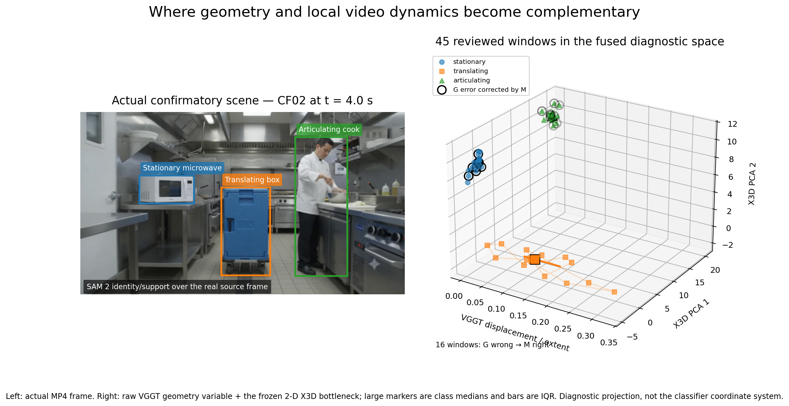
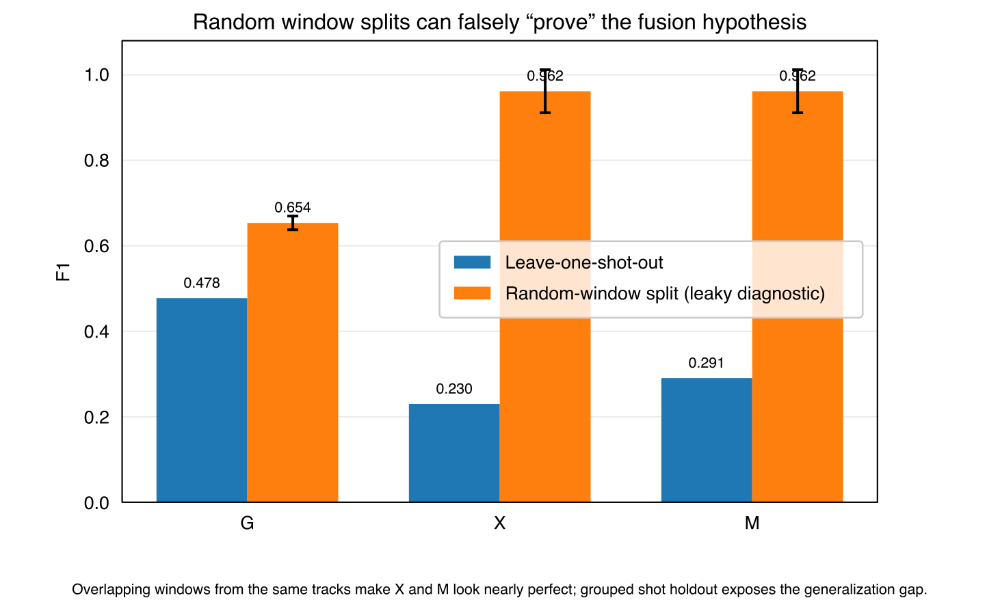

# From Relationships to Motion

## When Local Motion Evidence Helps Camera-Aware Geometry — and When Fusion Fails

*Article 04 — reviewed learned-model outputs, grouped evaluation, controlled multi-video discovery, and an independently frozen confirmatory test. The results form a bounded research study, not a general benchmark claim.*

The most convincing fusion result in this experiment was also the one I eventually stopped trusting at face value.

On four discovery videos, a compact X3D bottleneck improved held-out macro-F1 from **0.668 with geometry alone to 0.876 with fusion**. I then froze the representation, bottleneck and classifier and tested four untouched videos. The advantage contracted to **0.683 versus 0.673**.

That contraction became more informative than the original gain. The local video branch was not adding generic “motion intelligence.” Its measured effect was class-specific: it improved **articulation** substantially, improved **translation** slightly, and damaged **stationary** decisions that geometry was already getting right.

The original architectural question was simple: **can camera-aware 3D geometry and a 3D CNN become more useful together than either representation alone?** In the frozen test, fusion gained **+0.010 macro-F1** over geometry while accuracy and balanced accuracy were unchanged. The measured effect was positive, small and class-dependent.

The scene below is the clearest visual summary. It starts from an actual frame in a synthetic confirmatory video and connects persistent object support to two different forms of motion evidence: world-relative geometry from VGGT and local spatiotemporal structure from X3D-S.

*Figure 1: CF02 links SAM 2 object support with VGGT displacement and the frozen X3D bottleneck; black rings mark geometry errors corrected by fusion.*

## Artifacts

- [Public GitHub repository](https://github.com/vlada22/grounded-temporal-intelligence-public)
- [Live Semantic Motion Explorer](https://vlada22.github.io/grounded-temporal-intelligence-public/demo/)

## What I found

The experiments made the original fusion idea more specific — and less convenient.

1. **Camera compensation strengthened temporal interpretation in the original sequence.** The geometry condition aligned substantially better than screen-space motion with both frozen source reviews.
2. **Overlapping-window splits overstated performance.** Randomly splitting similar windows pushed the video and fusion conditions to roughly 0.96 F1; grouped holdout collapsed that apparent gain.
3. **Adding a high-dimensional branch reduced held-out performance.** The dense 2048-D video representation initially made the classifier worse, even after the representation path itself was corrected.
4. **Compression improved discovery-set transfer.** On a controlled four-video discovery benchmark, constraining the video branch to a tiny training-only subspace changed fusion from failed concatenation into the best held-out condition.
5. **Independent confirmation shrank that gain dramatically.** With the bottleneck and classifier frozen before new videos were reviewed, M moved from 0.673 to 0.683 macro-F1 over G — technically positive, but nowhere near the discovery gain.
6. **The useful complementarity was class-specific.** In the untouched confirmatory set, fusion improved articulation by about +0.199 F1 and translation by +0.033, while degrading stationary classification by about -0.202.
7. **The residual evidence was not uniformly reliable.** It corrected some geometry errors while replacing an equal number of correct geometry decisions in the frozen confirmatory set.

The result I would carry forward is therefore not simply “CNN + transformer works.” It is:

> **Complementary representations were not automatically compatible in this study. Compression exposed useful residual motion evidence on the discovery set, but the frozen confirmatory gain was small and class-dependent.**

## The system I actually tested

The tested representation combined three learned components with deliberately different roles:

**SAM 2 → persistent object support**  
**VGGT → camera-aware 3D geometry**  
**X3D-S → local spatiotemporal representation**

SAM 2 provides the association seam: after review, the geometry and video descriptors can refer to the same object timeline. VGGT contributes model-world camera state, centroids, extents and displacement. X3D-S contributes masked object-centric short-term dynamics.

The downstream task is not to merge those quantities into one fake latent coordinate system. It is to combine them while preserving what each branch means.

That distinction became important almost immediately.

## Finding 1 — camera-aware geometry outperformed screen-space motion in this source

The original synthetic source contains camera motion, static objects, rigid translation, articulated motion, occlusion, hard cuts and a blended transition.

I first compared two temporal representations that could emit the same `moving` / `stationary` event vocabulary:

- **T:** persistent identity plus screen-space motion;
- **G:** persistent identity plus camera-compensated VGGT geometry.

Against two frozen AI-assisted source reviews — used as provisional reference passes, not human validation — T reached F1 0.261 and 0.254, while G reached 0.638 and 0.653 at temporal IoU ≥ 0.5.

*Figure 2: On the original sequence, camera-aware geometry aligned better with the reviewed event vocabulary than screen-space motion.*

This is not a general benchmark. Within this source and vocabulary, the camera-aware state was the stronger measured baseline for testing whether local video evidence added anything.

## Finding 2 — adding a high-dimensional motion branch reduced held-out performance

The first supervised G/X/M experiment used dense object-centric windows from one synthetic sequence.

After correcting the X3D path to use masked RGB and a 2048-dimensional pre-classifier representation, the held-out result remained negative:

- **G — geometry:** F1 **0.478**; balanced accuracy **0.738**.
- **X — X3D:** F1 0.230; balanced accuracy 0.543.
- **M — geometry + X3D:** F1 0.291; balanced accuracy 0.620.

That failure was useful. The 2048-D X3D representation carried far more than the downstream task required: object appearance, local activity and scene-specific structure. In this small dataset, concatenating that dense representation with a compact geometry vector was associated with poor held-out transfer.

The most revealing diagnostic was deliberately invalid. When overlapping windows from the same tracks were randomly divided between train and test, X and M jumped to roughly 0.96 F1. Under grouped holdout, they collapsed.

*Figure 3: Random window splitting inflated X and M to about 0.96 F1; grouped shot holdout exposed the generalization gap.*

That result changed the direction of the work. A superficial split could have “proved” exactly the claim I wanted. The gap between random-window and grouped evaluation was consistent with fitting highly similar objects and overlapping windows rather than learning a transferable motion rule.

So I stopped trying to rescue the single-sequence score and changed the experiment.

## Finding 3 — a compact bottleneck improved the discovery result

The next benchmark used four independent synthetic videos with different camera regimes and three motion states in every video:

- **stationary** — no object motion;
- **translating** — rigid-body movement through the scene;
- **articulating** — local part motion while the entity remains approximately fixed in world position.

Each video became one reviewed 96-frame analytic clip. The final discovery set contained 172 reviewed windows, and evaluation held out the **entire video** so no object identity, overlapping window or scene from the test video entered training.

The originally planned 32-dimensional X3D PCA fusion still failed:

- **G — geometry:** macro-F1 **0.668**; balanced accuracy **0.694**.
- **X — X3D:** macro-F1 0.616; balanced accuracy 0.617.
- **M — wide fusion:** macro-F1 0.616; balanced accuracy 0.617.

More independent data alone did not solve the compatibility problem.

Then the dimensionality sensitivity analysis produced the strongest discovery finding in the article:

*Figure 4: Discovery-set fusion peaked with two X3D PCA components and weakened as the bottleneck widened.*

With a very small X3D subspace, M improved sharply. As more X3D dimensions were admitted, fusion progressively collapsed back toward the weaker X-only branch.

Because that pattern was discovered post-hoc, I did not simply report the best point. I repeated the selection inside a nested leave-one-video-out protocol. For every outer held-out video, the PCA width was chosen only from the three outer-training videos.

The inner procedure independently selected **two X3D components in all four outer folds**.

The resulting discovery performance was:

- **G — geometry:** macro-F1 0.668; balanced accuracy 0.694.
- **X — X3D bottleneck:** macro-F1 0.621; balanced accuracy 0.609.
- **M — compact fusion:** macro-F1 **0.876**; balanced accuracy **0.872**.

M corrected 45 G errors while introducing 13 regressions. Articulation showed the strongest class-level gain.

On this discovery benchmark, the branches became useful together only when the X3D representation was constrained to a compact training-only subspace.

But it was still a discovery result. The two-dimensional bottleneck had been found after looking at this benchmark.

## Finding 4 — frozen confirmation changes the interpretation

The next experiment froze the architecture before any new confirmatory video was reviewed:

- the nine geometry features;
- the masked 2048-D X3D representation;
- the X3D scaler;
- the **two-component PCA bottleneck**;
- the G, X and M logistic-regression weights;
- the class vocabulary;
- the primary criterion: **M macro-F1 > G macro-F1**.

Four new scenes were generated with different objects and camera paths. The analysis interval was fixed in advance at seconds 2.0–6.0. Two kitchen generations were rejected because an extra person entered that fixed interval; I regenerated the source rather than moving the interval.

After the GPU run, all 469 manifest-tracked files matched their recorded byte size and SHA-256. Before exposing classifier predictions, I reviewed all 12 SAM 2 identities and all 180 X3D windows. No confirmatory window was excluded.

Then the frozen model was applied once.

The discovery-to-confirmation comparison summarizes the main change in interpretation:

*Figure 5: Fusion’s macro-F1 gain shrank from +0.208 in discovery to +0.010 under frozen confirmation.*

The discovery gain contracted from **G 0.668 → M 0.876** to **G 0.673 → M 0.683** on the untouched confirmatory set.

The full frozen result is:

- **G — geometry:** macro-F1 0.673; balanced accuracy **0.689**; accuracy **0.689**.
- **X — X3D bottleneck:** macro-F1 0.522; balanced accuracy 0.517; accuracy 0.517.
- **M — compact fusion:** macro-F1 **0.683**; balanced accuracy **0.689**; accuracy **0.689**.

The preregistered primary criterion was technically met: M macro-F1 was higher than G macro-F1.

But the margin was only **+0.010**. Accuracy and balanced accuracy were unchanged. M corrected 41 G errors and introduced exactly 41 new errors. It beat G on macro-F1 in only one of the four confirmatory videos.

That is weak/mixed confirmation, not a replication of the discovery magnitude.

And that contraction is one of the most valuable findings in the work. Without the independent set, it would have been very easy to stop at 0.876 and overstate the architecture.

## Finding 5 — the confirmatory gain was concentrated in articulation

The pooled metric hides the real behavior.

The direct change from G to M on the untouched confirmatory set is:

*Figure 6: Frozen fusion improved articulation and translation but degraded stationary classification.*

- **stationary:** 0.653 → 0.451 F1, **-0.202**;
- **translating:** 0.932 → 0.966 F1, **+0.033**;
- **articulating:** 0.435 → 0.634 F1, **+0.199**.

This class-level result is the clearest evidence for complementarity in the frozen test.

In this test, geometry was strong at rigid translation because world-relative displacement is exactly what the representation preserves. It was weaker at local articulation when the entity remained approximately fixed in space. In those cases, the short-term X3D representation added information that a centroid trajectory did not express.

But the same branch also hurt stationary classification. Those regressions are consistent with local visual dynamics appearing action-like to the classifier even when the geometry condition was correctly stationary.

So the independent experiment does not say that X3D is generally better than geometry, or even that compact fusion is generally better than geometry. It says something narrower and more useful:

> **In the frozen test, local video evidence improved articulation but displaced correct stationary decisions; the pooled macro-F1 gain over geometry was +0.010.**

## Finding 6 — the measured tradeoff motivates conditional fusion

The reverse-dolly kitchen scene, CF02, was the one untouched confirmatory case where the frozen fusion model clearly improved over geometry alone: macro-F1 rose from 0.633 to 0.933. That makes it a useful explanatory scene, provided it is not mistaken for aggregate evidence.

The opening visual uses that scene deliberately. It connects an **actual frame from the synthetic source video** to the measured representation used by the classifier. SAM 2 provides persistent support for the stationary microwave, translating box and articulating cook; the 3D cube places all 45 reviewed CF02 windows using one explicit VGGT geometry variable and the two frozen X3D bottleneck components. Black rings mark the 16 windows where G was wrong and M corrected it.

It is deliberately **not an invented shared embedding**. The x-axis remains an interpretable geometry quantity, while the other two axes are the frozen X3D PCA components selected from the discovery data. CF02 is a representative positive case; the discovery-vs-confirmation and class-delta plots remain the aggregate evidence.

Returning to that opening visual after the confirmatory results makes the architectural implication easier to see. In CF02, rigid translation created a strong geometry signal, while articulation occupied a different region of the compact video subspace even when world-relative displacement stayed small. The branches contributed different evidence, but the aggregate confirmatory tradeoff showed that this evidence was not uniformly reliable.

The discovery model effectively uses:

**M = [ G || B(X) ]**

where `B(X)` is the compact X3D bottleneck.

The next hypothesis I would test is a conditional residual model:

**M = G + α(G, B(X), U) · R(B(X))**

where `α` is a learned reliability gate, `R` is the video residual, and `U` can include support or uncertainty signals.

That changes the question from “how many X3D features should I concatenate?” to “when should local video evidence be allowed to alter a geometry decision?”

The confirmatory class tradeoff motivates this next experiment; it does not establish that gating will solve the problem.

## The failures were part of the result

Two lessons from the failed runs became important enough to treat as findings rather than implementation notes.

### Artifact integrity is not experiment validity

Two early GPU bundles passed their manifest checks and were still scientifically rejected. Run 00 verified all 275 tracked entries, but undeclared hard cuts created false continuity across identity, geometry and X3D tubes. The following v4 bundle verified all 288 tracked entries, but a six-frame dissolve escaped the hard-cut detector and contaminated the long laboratory shot.

The hashes proved that the returned bytes were intact. They did **not** prove that those bytes represented a valid experiment.

That distinction matters in multimodel pipelines: reproducibility has at least two layers. A reproducible experiment needs byte-level provenance and semantic validity for the time intervals, identities, coordinate systems and support used to produce those bytes.

### Cross-branch disagreement exposed hidden pipeline failures

The missed dissolve did not first present itself as an editing problem. It appeared as a cross-model anomaly. VGGT showed a 0.2401 model-unit camera discontinuity and a 13.8° rotation between nearby retained frames. Around the same transition, SAM 2 masks developed gaps and X3D tubes crossed depicted views that should never have shared one temporal window.

Those failures looked unrelated until they were traced back to the same transition.

In these failed runs, disagreement between branches exposed pipeline errors that were not obvious inside any one branch. That measured behavior motivates a broader observability hypothesis: geometry discontinuity, identity instability and temporal inconsistency may be useful triggers for cross-branch review.

Several other failures reinforced the same boundary:

- SAM 2 produced a same-shot identity switch in the original sequence;
- the first X3D path captured task-head output rather than the representation intended for fusion;
- the pre-classifier hook initially exposed a residual 2×2 spatial grid, which had to be globally averaged to a 2048-D clip vector;
- overlapping-window splits manufactured an implausibly strong X3D result;
- one generated discovery target was not actually articulating during the whole intended interval;
- two confirmatory kitchen videos violated the frozen source protocol and were rejected rather than repaired post-hoc.

The common lesson is that **fusion does not repair invalid semantics. It propagates them.**

Identity, edit boundaries, source hashes, support validity and review state are therefore part of the representation contract, not administrative metadata.

## What this experiment measured

The strongest defensible measured conclusions are:

1. camera-aware geometry materially improved motion interpretation over screen-space temporal motion on the original source;
2. local video evidence was complementary for some classes and still hurt downstream generalization when fused uniformly;
3. grouped evaluation avoided the misleading scores produced by random overlap among dense temporal windows;
4. a compact bottleneck exposed a strong discovery-set fusion signal under nested held-out-video evaluation;
5. the frozen independent set did **not** reproduce that gain at the same magnitude;
6. the confirmatory signal was class-specific: articulation improved substantially, translation improved slightly, and stationary classification degraded;
7. artifact integrity alone is insufficient — temporal, identity and support semantics must also remain valid;
8. cross-branch disagreement exposed pipeline failures that were not obvious inside any one branch;
9. the measured class tradeoff motivates testing **reliability-aware fusion** rather than simply adding capacity.

What this does **not** establish is that a two-component PCA bottleneck is universally optimal, that M broadly outperforms G, or that these synthetic scenes constitute a general computer-vision benchmark.

The value of the experiment is narrower: it measured how camera-aware geometry and local video evidence interacted in this controlled setting, then followed that interaction far enough to expose both the benefit and the failure mode.

## Measured takeaway and next hypothesis

Article 4 began with the idea of combining the global spatial reasoning of a vision transformer with the local temporal reasoning of a 3D CNN.

The final result is more useful than a simple win/loss comparison.

**In this experiment, geometry provided the stronger stable state baseline. Compressed local video evidence improved articulation, but its pooled confirmatory gain was small because stationary decisions degraded.**

I would therefore preserve geometry as the state prior and let specialized temporal evidence modify that state only conditionally:

**M = G + α(G, B(X), U) · R(B(X))**

In that proposed model, the key term would be `α`: a reliability mechanism intended to suppress an action-like X3D residual when geometry is confidently stationary, while admitting it when local articulation is exactly what geometry cannot represent.

The measured finding is the class-dependent tradeoff. **Explicit state plus gated residual evidence** is the next architectural hypothesis, not an established result.
