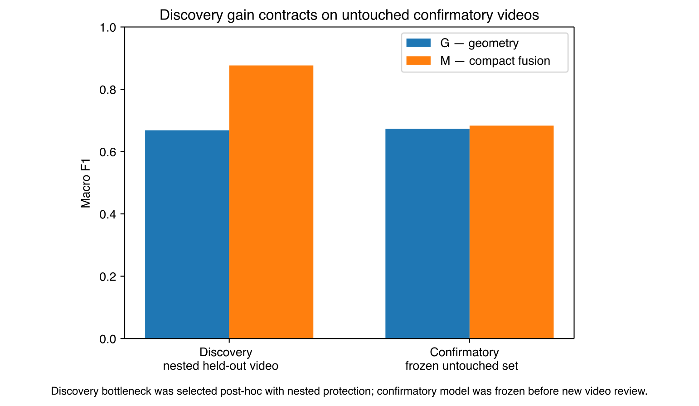
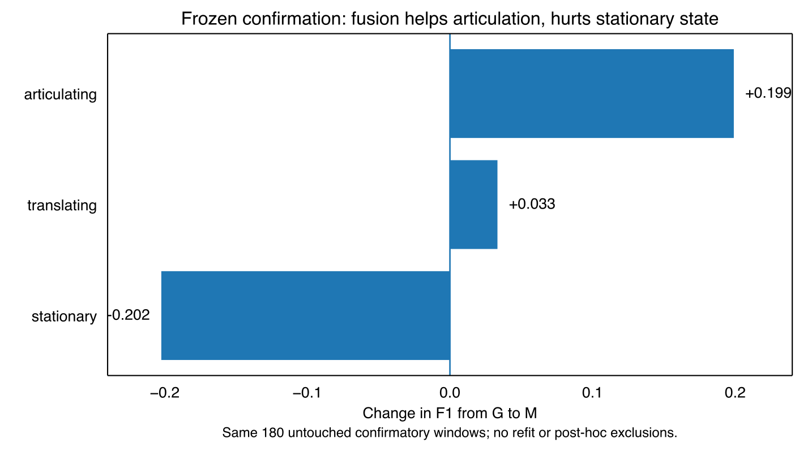

# Independent frozen confirmatory result

This is the public summary of the untouched confirmatory evaluation for the Article 04 compact fusion model.

The representation, scalers, two-component X3D bottleneck, G/X/M classifiers, class vocabulary, and primary criterion were frozen before the four new confirmatory sources were reviewed. All 12 tracks and all 180 reviewed X3D windows were retained.

## Primary result

| condition | macro F1 | balanced accuracy | accuracy |
| --- | ---: | ---: | ---: |
| G — geometry | 0.673 | **0.689** | **0.689** |
| X — X3D bottleneck | 0.522 | 0.517 | 0.517 |
| **M — compact fusion** | **0.683** | **0.689** | **0.689** |

The preregistered criterion `M macro-F1 > G macro-F1` is met, but only narrowly: `+0.010` macro-F1. M and G have identical accuracy and balanced accuracy; M corrects 41 G errors and introduces 41 new errors.

The pooled gain is a class tradeoff:

- stationary: `0.653 -> 0.451` F1 (`-0.202`)
- translating: `0.932 -> 0.966` F1 (`+0.033`)
- articulating: `0.435 -> 0.634` F1 (`+0.199`)

This is therefore weak/mixed confirmation rather than a replication of the discovery magnitude. The result supports a narrower interpretation: X3D contributes useful articulation evidence, while unconditional fusion can override already-correct stationary geometry decisions.

## Public boundary

The frozen numeric model payload, per-window evaluation internals, raw GPU return ZIP, and descriptor arrays remain private. The public repository retains the aggregate frozen result and publication figures.
