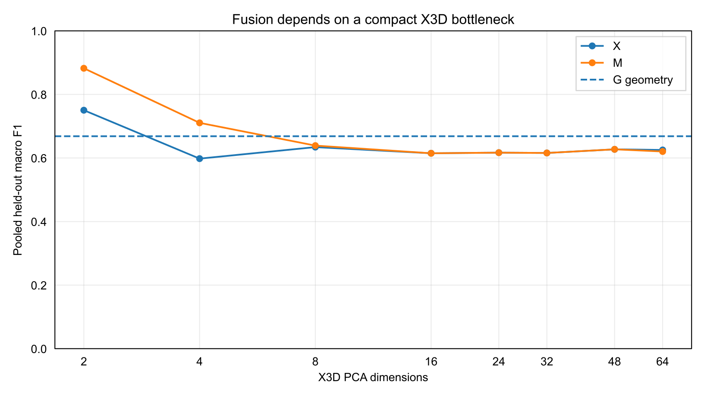

# Controlled multi-video discovery result

This is the public summary of the Article 04 controlled four-video supervised fusion benchmark.

The final reviewed discovery set contains 172 windows (`stationary=60`, `translating=60`, `articulating=52`) with whole-video holdout so test identities, overlapping windows, and source scenes do not enter training.

## Baseline and bottleneck finding

The originally planned 32-D X3D PCA fusion does not improve over geometry:

| condition | macro F1 | balanced accuracy |
| --- | ---: | ---: |
| G — geometry | **0.668** | **0.694** |
| X — X3D | 0.616 | 0.617 |
| M — wide fusion | 0.616 | 0.617 |

A post-hoc bottleneck analysis showed strong sensitivity to X3D dimensionality. Nested outer/inner held-out-video selection chose **2 PCA components in all four outer folds**, using only outer-training videos for selection.

Under that exploratory nested protocol:

| condition | macro F1 | balanced accuracy |
| --- | ---: | ---: |
| G — geometry | 0.668 | 0.694 |
| X — X3D bottleneck | 0.621 | 0.609 |
| **M — compact fusion** | **0.876** | **0.872** |

M corrects 45 G errors while introducing 13 regressions. Because the bottleneck width was discovered on this benchmark, this is a discovery result rather than independent confirmation.

## Public boundary

The raw X3D arrays, fitted model payloads, GPU return archive, and per-window private research artifacts remain outside the public repository.
