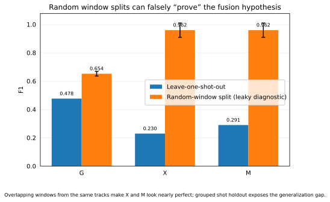

# Representation-level fusion result

This is the public summary of the corrected Article 04 representation-level G/X/M experiment.

The corrected X3D-S path uses masked object-centric RGB and the 2048-D pre-classifier representation. The evaluation keeps reviewed labels, geometry features, classifier family, and grouped leave-one-shot-out evaluation fixed.

## Held-out result

205 reviewed windows were evaluated (`moving=26`, `stationary=179`).

| condition | F1 | balanced accuracy | precision | recall |
| --- | ---: | ---: | ---: | ---: |
| G — geometry | **0.478** | **0.738** | 0.390 | 0.615 |
| X — X3D representation | 0.230 | 0.543 | 0.149 | 0.500 |
| M — geometry + X3D | 0.291 | 0.620 | 0.187 | 0.654 |

Naive late concatenation does not outperform geometry under proper grouped evaluation.

## Leakage diagnostic

A deliberately invalid random-window split places overlapping windows from the same tracks in both train and test. Under that leaky split, X and M reach mean F1 of roughly `0.962`, compared with `0.230` and `0.291` under leave-one-shot-out evaluation.

The random-window score is **not** a performance result. It is retained to show how temporal overlap can manufacture an apparently successful fusion result.

## Public boundary

The raw 2048-D `.f32` descriptors and GPU return bundle remain private. This public repository retains the reviewed aggregate result and the publication diagnostic only.
